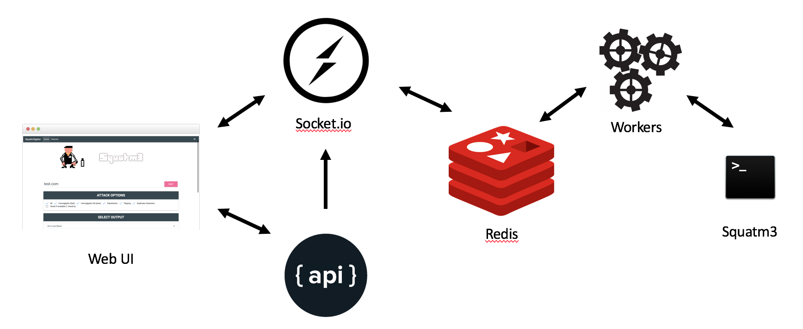

## About Squatm3gator


 <br><br>
Squatm3gator is a complete web solution based on the python tool squatm3, designed to enumerate available domains generated modifying the original domain name through different techniques:

-	Substitution attacks
-	Flipping attack
- 	Homoglyph attack fast (execute a fast homoglyph attack, mutating only one letter at the time)
-   Homoglyph attack complete (generates all the possible combinations)


The tool is meant to help penetration testers to identify domains to be used in phishing attack simulations and security analysts to detect and prevent cybersquatting attacks.


## Architecture

 <br> 


## Installation


### Clone the repo
```
git clone https://github.com/david3107/squatm3gator.git

```

## Run the docker container

Use the docker-compose command to build and run the flask application

```
docker-compose up --build

```

## Run the application 


The application is available on `http://localhost:5000/`

## License

Squatm3gator is licensed under the GNU GPL license.


## Version
Current version is 1.5

## Presented at

[Black Hat Arsenal Europe 2018](https://www.blackhat.com/eu-18/arsenal/schedule/index.html#squatm-cybersquatting-made-easy-13319)
       
